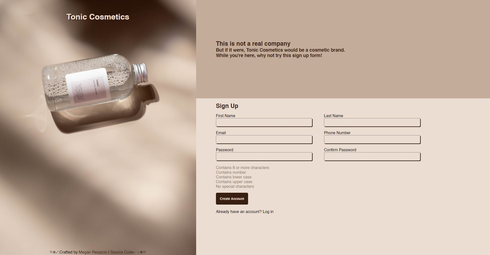

# tonic-sign-up-form

[Live Demo](https://mrespicio.github.io/tonic-sign-up-form/)

## Preview

## Project Goals
* Create a sign-up form using HTML form validation
* Practice responsive CSS

## The Plan
I will tackle this project by focusing on creating the form first. After creating the form, I will use HTML form validation to ensure all inputs have the desired data. I will use pseudo-classes to help highlight when a form field is valid or not. I will use Javascript to create custom validation prompts, especially for the password and password confirmation fields. Once I'm satisfied with the form validation, I can style the page as I wish.

## Built With
### Technologies
* HTML
* CSS
* JavaScript
### Tools
* Git and GitHub
* Visual Studio Code

## New Skills
* Used built-in HTML validation and custom JS validation in creating this sign up form
* Practiced regular expressions to implement pattern validation
* Used pseudo-classes for styling custom validation prompts

## Reflection
This project made me touch on new concepts. Although I was already familiar with basic HTML form validations, my new skills of being able to implement custom validations using Javascript has opened up the possibilities of forms I can create. 

Learning pseudo-classes and implementing them for styling was a challenge for me at first, as it was a completely new topic for me. The basic principle of styling an element when valid and invalid wasn't too difficult, but it became a problem when the :invalid rule applied when the page first loaded, making all the fields have a red outline at first - a feature I did not intend for. I was able to overcome this challenge by introducing the :not and :placeholder-shown pseudo class. 

This project also compelled me to practice more with responsive design. I used a combination of flexbox and grid to ensure responsiveness throughout the page design.

## Misc
This project was created as an assignment for [The Odin Project](https://www.theodinproject.com/lessons/node-path-intermediate-html-and-css-sign-up-form)
Completed: June 2023